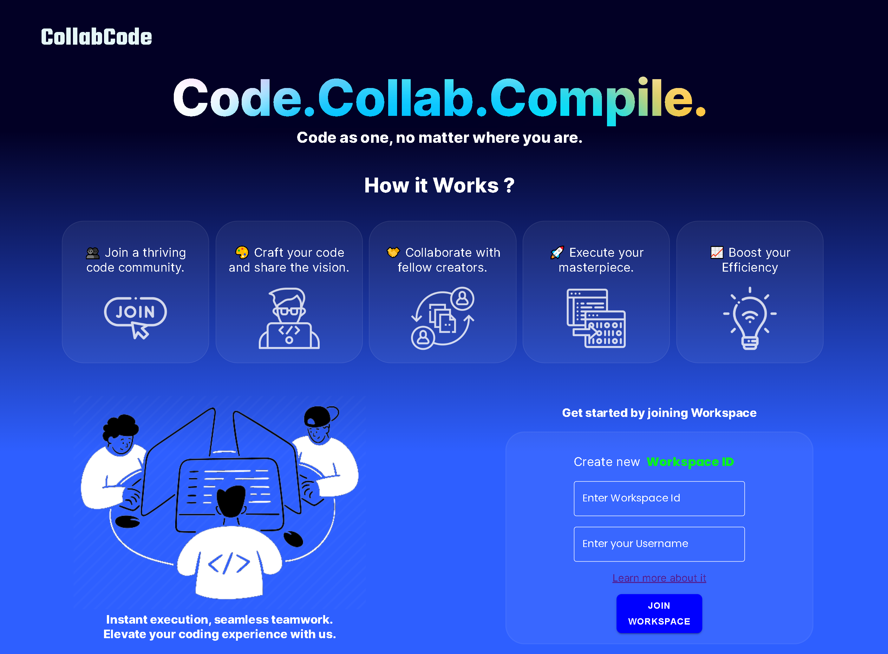
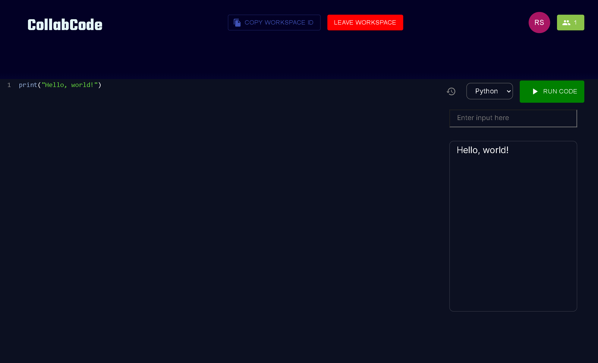

# CollabCode - Real-Time Code Collaborator 🚀

Welcome to our Real-Time Code Collaborator project! This platform is meticulously designed to empower developers worldwide, facilitating collaborative coding in real-time and running the code. It's a space that nurtures seamless teamwork and accelerates the entire development process.

## This is how it looks
### Home Page🏠


### Workspace Page💻



### Live Demo : https://realtimecodecollabarator.onrender.com/
## Features 🌟

- **Real-Time Collaboration:** Work concurrently with multiple developers, witnessing changes in real-time.
- **Multi-Language Support:** Code in your preferred language with support for C, C++, Java and Python.
- **Run Code:** Run the code in the same environment.
- **Rich Code Editor Features** Harnessing the power of CodeMirror, it has features of syntax highlighting for multiple languages, search and find code using (Ctrl + F )shortcut,  move your code line up-down using (Alt + up/down) arrow, code wrapper,etc.

## Technologies Used ️

### Core Technologies

- **React:** A powerful JavaScript library for building dynamic and interactive user interfaces. ([Official Documentation](https://reactjs.org/))
- **Node.js:** A JavaScript runtime environment that allows executing JavaScript code outside of a web browser, enabling server-side development and a wide range of tools and libraries. ([Official Documentation](https://nodejs.org/))

### Libraries and Tools

- **CodeMirror:** A versatile in-browser code editor providing features like syntax highlighting, autocompletion, and collaborative editing. ([Official Documentation](https://codemirror.net/))
- **Compilex:** A dynamic code execution engine that allows running code in real-time, supporting multiple programming languages. ([Official Documentation](https://link-to-compilex-documentation))

## Getting Started 🚀

1. **Clone the Repository:**
   ```bash
   git clone https://github.com/your-username/realtimecodecollaborator.git
   cd realtimecodecollaborator
   ```
2. **Install Dependencies:**
```bash
cd frontend && npm install && cd ../backend && npm install
```
3. **Configure Environment Variables:**

- Create a .env file in the server directory and set the required variables.
4.**Run the Application:**
```bash
# In the server directory
npm run server

# In the client directory
npm start
```
5.**Access the Application:**
- Open your browser and navigate to http://localhost:3000 to start collaborating on code in real-time!

## Language Support 🌐
####  Our platform currently supports the following languages:
- C
- C++
- Java
- Python

## Future Scope🚀


CollabCode has a promising future with several exciting possibilities for advancement:

- **Integration with Online Coding Platforms:** Connect with platforms like HackerRank or Codewars to leverage their extensive problem sets and judging capabilities. This would allow users to practice, compete, and improve their coding skills within the CollabCode environment.

- **Enhanced Collaboration Features:** Implement features like real-time chat, code commenting, and shared cursors to further streamline teamwork and communication.

- **Support for More Languages:** Expand language support to encompass a wider range of programming languages, catering to a more diverse developer community.

- **Visual Debugging Tools:** Integrate visual debugging tools to aid developers in identifying and resolving errors in their code collaboratively.

- **Version Control Integration:** Introduce integration with version control systems like Git to enable efficient code management and tracking of changes.

- **Educational Use Cases:** Tailor the platform for educational purposes, allowing instructors to create collaborative coding assignments and track student progress.

Feel free to contribute and expand the language support to make our platform even more versatile!


### Contributing 🤝
We welcome contributions from the community! Whether it's bug fixes, feature enhancements, or language support additions, your input is valuable. Please refer to our Contribution Guidelines for more details.


Happy coding! 🚀✨
